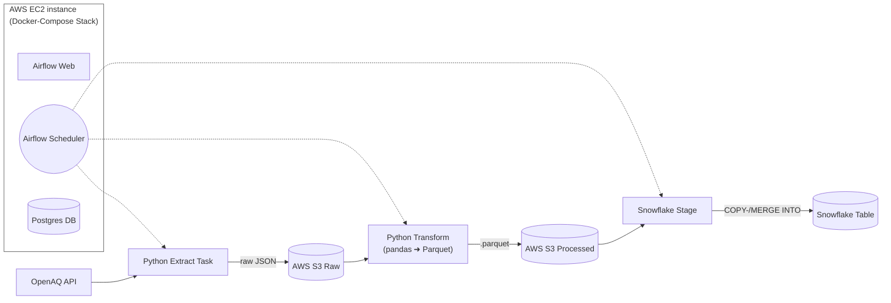

# Clean Air Pipeline

<p align="center">
  <a href="https://www.python.org/"></a>
  <a href="https://airflow.apache.org/"></a>
  <a href="https://www.docker.com/"></a>
  <a href="https://aws.amazon.com/"></a>
  <a href="https://www.snowflake.com/"></a>
  <a href="https://github.com/psf/black"></a>
  <a href="LICENSE.md"></a>
</p>


An automated, containerized ETL pipeline that fetches air-quality data from OpenAQ daily via Python scripts, stores raw JSON in AWS S3, transforms it to .parquet and loads it into Snowflake as fact-dimensional data model. Orchestrated with Apache Airflow v3 and deployable on AWS EC2 or any Docker-capable server. This pipeline helps researchers and data analysts to quickly obtain processed datasets from public sensors. The deliverable of this pipeline is a fact table (and dimension tables for context)  containing daily air quality measurements for (e.g. for particles <2.5um) for the specified location.

---
## Features

* **Extract:** Pulls PM₂.₅ measurements from OpenAQ for a configurable location. Default setting is Berlin (52.520008,13.404954) + 15km radius
* **Raw Storage:** Saves raw JSON using Hive-style partitioning (raw/YYYY/MM/) on s3/raw
* **Transform:** Converts JSON → Parquet (pandas + PyArrow) and saves on S3/processed.
* **Load:** Loads Parquet into a pre-defined fact-dimensional model via Snowflake external stage & COPY INTO/MERGE.
* **Orchestration:** Airflow v3 DAGs with retries, logging, and scheduling.
* **Container Deployment:** Docker Compose stack for Airflow
* **Auto-run:** 24/7 operation on AWS EC2 (t3.large) or any VPS.

---

## Components & Architecture

This pipeline is designed to be modular. The core consists of Python scripts running in a Docker environment. The reference implementation shown here uses AWS S3 as storage and Snowflake as a data warehouse.

### Core Prerequisites (Minimal Setup)
* **AWS Account**
* **Snowflake Account**
* **Docker & Docker Compose:** To run the containerized application (Airflow, Python tasks).
  

### Prerequisites for the Reference Implementation (with Cloud)
* **AWS:** Required to store data persistently on S3.
* **Snowflake:** Serves as the target data warehouse. The `LOAD` logic is specific to Snowflake but can serve as a template for loading data into any other SQL database.

### Architecture



### Conceptual Data Model


---

## Getting Started: Installation & Setup

This guide helps you to set up and run the entire reference implementation. The configuration is managed via a central `.env` file.

### Docker Setup

Everything you need is packacked witin Docker. Python dependencies are included within requirements.txt.

For local development install Docker Desktop. 

For deployment, a Dockerfile containing the image and a docker-compose.yaml is provided. The dockerimage is based on the apache/airflow:3.0.6-python3.11 image with minimal adjustments.

The docker-compose.yaml is the Airflow v3 template provided by Apache with some adjustmens made for the project.

### Central Configuration
The following config needs to be stored in .env:
```
# .env file

# AWS
AWS_ACCESS_KEY_ID
AWS_SECRET_ACCESS_KEY
S3_BUCKET

# OpenAQ
API_KEY

# Snowflake
SNOWFLAKE_PRIVATE_KEY
SNOWFLAKE_PRIVATE_KEY_PASSPHRISE

SNOWFLAKE_ACCOUNT
SNOWFLAKE_USER
SNOWFLAKE_WAREHOUSE
SNOWFLAKE_ROLE
SNOWFLAKE_DATABASE
SNOWFLAKE_SCHEMA

# Airflow
_AIRFLOW_WWW_USER_USERNAME
_AIRFLOW_WWW_USER_PASSWORD
AIRFLOW_UID
```
### AWS Setup (S3 & IAM)
The pipeline requires 
- An S3 bucket for storage 
- IAM roles with required permissions for
  - EC2 to run the pipeline
    - ListBucket
    - GetObject
    - PutObject
    - DeleteObject
  - Snowflake to read from S3
    - GetObject
    - GetObjectVersion (optional)
    - GetObject
    - PutObject
    - DeleteObject
  
- Policies to realize permissions

**EC2 policy:**
```JSON
{
    "Version": "2012-10-17",
    "Statement": [
        {
            "Sid": "AllowBucketListing",
            "Effect": "Allow",
            "Action": "s3:ListBucket",
            "Resource": "arn:aws:s3:::<YOUR_BUCKET_NAME>"
        },
        {
            "Sid": "AllowObjectActions",
            "Effect": "Allow",
            "Action": [
                "s3:GetObject",
                "s3:PutObject",
                "s3:DeleteObject"
            ],
            "Resource": "arn:aws:s3:::<YOUR_BUCKET_NAME>/*"
        }
    ]
}
```
**Snowflake role policy:**
```JSON
{
    "Version": "2012-10-17",
    "Statement": [
        {
            "Effect": "Allow",
            "Action": [
                "s3:GetObject",
                "s3:GetObjectVersion"
            ],
            "Resource": "arn:aws:s3:::<YOUR_BUCKET_NAME>/*"
        },
        {
            "Effect": "Allow",
            "Action": [
                "s3:ListBucket"
            ],
            "Resource": "arn:aws:s3:::<YOUR_BUCKET_NAME>"
        }
    ]
}
```
**Snowflake role trust relationship trust policy:** (This step is to be done after creating all objects  within Snowflake which is explained in the following section)
```JSON
{
    "Version": "2012-10-17",
    "Statement": [
        {
            "Effect": "Allow",
            "Principal": {
                "AWS": "<THE_COPIED_STORAGE_AWS_IAM_USER_ARN>"
            },
            "Action": "sts:AssumeRole",
            "Condition": {
                "StringEquals": {
                    "sts:ExternalId": "<THE_COPIED_STORAGE_AWS_EXTERNAL_ID>"
                }
            }
        }
    ]
}
```

### Snowflake Setup
To avoid manual errors, required Snowflake objects (Database, Schemas, Tables, Storage Integrations, File formats) are created by a single script (schema.sql). Stages have to be created manually.

Open the setup script sql/schema.sql and fill in your SNOWFLAKE_WAREHOUSE and SNOWFLAKE_DATABASE.

Execute the Script: Run the entire SQL script in your Snowflake worksheet. It will create everything needed. Stages have to be created manually.

Get Integration Details: After running the script, execute the following command in Snowflake to get the identifiers needed to link AWS and Snowflake:
```sql
DESC INTEGRATION s3_integration;
```
Update .env: Copy the STORAGE_AWS_IAM_USER_ARN and STORAGE_AWS_EXTERNAL_ID values from the command output into your .env file.

Update IAM: Grant the IAM User from Step 3 permissions to assume the role created by Snowflake (this step connects the two services).

### Run the Pipeline 
Once your .env file is complete, you can start the entire stack.

```
docker-compose up -d (--build)
```

This will run Docker do build all containers based on the dockerfile and configure them as defined in docker-compose.yaml. 

To access the Airflow UI:
```bash
# Local development
http://local_ip:8080 

# EC2
http://ec2_ip:8080 
```  

## Airflow DAGS
### daily_openaq_dag.py
Daily run which extracts needed endpoints to load data into dim_location, dim_sensor and fact_measurements
```python
import pendulum

from airflow.models.dag import DAG
from airflow.operators.python import PythonOperator

# Import the specific runner function for the daily tasks
from src.pipeline_runner import run_daily_pipeline

with DAG(
    dag_id='daily_clean_air_etl',
    start_date=pendulum.datetime(2025, 8, 30, tz="Europe/Berlin"),
    schedule='@daily',
    catchup=False,
    doc_md="""
    ### Daily Clean Air ETL DAG

    This DAG runs daily to perform the following steps:
    - Extracts data from the OpenAQ API for endpoints: locations, sensors, measurements
    - Stores data on S3 raw/
    - Transforms the raw data into a clean, usable format
    - Stores data on S3 /processed
    - Loads the transformed data into Snowflake dim and fact tables
    """,
    tags=['daily', 'etl', 'openaq'],
) as dag:
    
    run_daily_etl_task = PythonOperator(
        task_id='run_daily_etl',
        python_callable=run_daily_pipeline
    )
```

### weekly_openaq_dag.py
Weekly run to load data into dim_parameter. This will not change often and is sufficient to be loaded weekly or even monthly.

```python
import pendulum

from airflow.models.dag import DAG
from airflow.operators.python import PythonOperator

# Import the specific runner function for the weekly tasks
from src.pipeline_runner import run_weekly_pipeline

with DAG(
    dag_id='weekly_clean_air_etl',
    start_date=pendulum.datetime(2025, 8, 30, tz="Europe/Berlin"),
    schedule='@weekly',
    catchup=False,
    doc_md="""
    ### Weekly Snowflake Load DAG

    This DAG runs weekly to perform the following steps:
    - Extracts data from the OpenAQ API for endpoints: parameters
    - Stores data on S3 raw/
    - Transforms the raw data into a clean, usable format
    - Stores data on S3 /processed
    - Loads the transformed data into Snowflake dim and fact tables
    """,
    tags=['weekly', 'load', 'snowflake'],
) as dag:
    
    run_weekly_load_task = PythonOperator(
        task_id='run_weekly_etl',
        python_callable=run_weekly_pipeline
    )
```

## Pipeline Steps
- Single pipeline steps are called via Airflow DAG(s)
- Runner.py as entrypoint and configuration for order of steps

**extract\_openaq.py**
  - Calls openaq endpoints via generic utility functions (for documentation see https://docs.openaq.org/)
  - Serializes raw responses.json within S3:bucket/raw/endpoint, one file per response (pages are combined)
  
**transform\dim_/fact_.py**
  -  Lists raw keys from S3:bucket/raw/endpoint
  -  Reads json files
  -  Loops through responses 
  -  Stores within pandas DF
  -  Transforms and serializes to parquet file format
  -  Create S3 Key 
  -  Uploads to S3
   
**load\dim_/fact_.py**
  -  truncates table for full loads
  -  List stage content
  -  copy into / merge into Snowflake tables

---

## Project Structure 

```
clean-air-pipeline/
├── .github/ 
|    └── README.md 
├── .venv/       
├── dags/
│   ├── daily_openaq.py
│   └── weekly_openaq.py    
├── plugins
├── sql
|    └── schema.sql    
├── src/
|   ├── utils/
|   |   |── __init__.py
|   |   |── extract_openaq_utils.py
|   |   |── snowflake_connector.py
|   |   └── transform_utils.py
|   |── __init__.py
|   ├── pipeline_runner.py
│   ├── extract_openaq_locations.py
│   ├── extract_openaq_measurements.py
│   ├── extract_openaq_parameters.py
│   ├── extract_openaq_sensors.py
│   ├── transform_dim_location.py
│   ├── transform_dim_parameter.py
│   ├── transform_dim_sensor.py
│   └── transform_fact_measurement.py            
├── .env
├── .dockerignore
├── .gitignore
├── dockerfile
├── docker-compose.yaml
└── requirements.txt
```

---

## Troubleshooting

* **Missing API_KEY** → Check .env configuration
* **AWS 403** → check S3 bucket policy
* **Airflow tasks failing** → inspect logs in Airflow UI
* **Parquet schema errors** → verify JSON structure

---

## Contributing

1. Open an issue or feature request
2. Fork and create a feature branch
3. Submit a pull request with prefixes like `feat:` or `fix:`
4. Review & merge

---

## License

MIT © 2025 LeoGr777