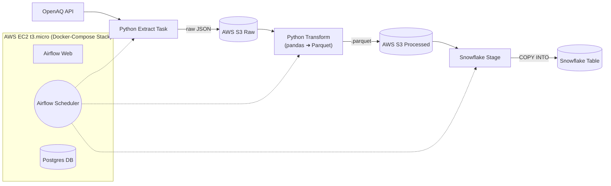

# Clean Air Pipeline

An automated, containerized ETL pipeline that fetches air-quality data from OpenAQ every three hours, stores raw JSON in AWS S3, transforms it to Parquet with Python, and loads it into Snowflake. Orchestrated with Apache Airflow and deployable on AWS EC2 or any Docker-capable server.

---

## 📋 Contents

* [Features](#features)
* [Architecture](#architecture)
* [Prerequisites](#prerequisites)
* [Installation & Setup](#installation--setup)
* [Pipeline Steps](#pipeline-steps)
* [Project Structure](#project-structure)
* [Usage](#usage)
* [Configuration](#configuration)
* [Troubleshooting](#troubleshooting)
* [Contributing](#contributing)
* [License](#license)

---

## 🔥 Features

* **Extract:** Pulls PM₂.₅ measurements from OpenAQ for a configurable city
* **Raw Storage:** Saves raw JSON into `raw/YYYY/MM/` (or S3/raw)
* **Transform:** Converts JSON → Parquet (pandas + PyArrow) into `processed/` (or S3/processed)
* **Load:** Loads Parquet via Snowflake external stage & `COPY INTO`
* **Orchestration:** Airflow DAG with retries, logging, and scheduling
* **Container Deployment:** Docker Compose stack for Airflow, Postgres, ETL, optionally Streamlit
* **Auto-run:** 24/7 operation on AWS EC2 (t3.micro) or any VPS

---

## 🏗 Architecture



---

## 🔧 Prerequisites

* **AWS CLI** configured with S3 PutObject permissions
* **Docker & Docker Compose** installed (locally or on EC2)
* **Python 3.9+** with virtual environment support
* **Snowflake account** (Trial works)
* Optionally: **Streamlit**, **jq** for local testing

---

## 🚀 Installation & Setup

1. **Clone the repo**

   ```bash
   git clone git@github.com:LeoGr777/clean-air-pipeline.git
   cd clean-air-pipeline
   ```

2. **Create & activate venv**

   ```bash
   python3 -m venv .venv
   source .venv/bin/activate
   pip install --upgrade pip
   pip install -r requirements.txt
   ```

3. **Initialize folders**

   ```bash
   mkdir -p src raw processed
   ```

4. **Configure AWS CLI**

   ```bash
   aws configure
   ```

5. **Set up Snowflake**

   ```sql
   CREATE STAGE openaq_stage
     URL='s3://<your-bucket>/processed'
     CREDENTIALS=(AWS_KEY_ID='…' AWS_SECRET_KEY='…');

   CREATE TABLE air_quality (
     location VARCHAR,
     parameter VARCHAR,
     value FLOAT,
     unit VARCHAR,
     date_utc TIMESTAMP_LTZ,
     city VARCHAR,
     country VARCHAR
   );
   ```

---

## 📝 Pipeline Steps

1. **extract\_openaq.py**

   ```bash
   python src/extract_openaq.py
   ```

   → saves JSON in `raw/YYYY/MM/`

2. **upload\_to\_s3**
   – add `boto3` function or Airflow task to upload raw files

3. **transform\_parquet.py**
   – `pandas.json_normalize` → `to_parquet(...)` → `processed/dt=YYYY-MM-DD/`

4. **Airflow DAG**
   – `dags/openaq_pipeline.py`, schedule `0 */3 * * *`

5. **Snowflake COPY**
   – Airflow PythonOperator or SnowflakeOperator runs:

   ```sql
   COPY INTO air_quality
   FROM @openaq_stage
   FILE_FORMAT=(TYPE=PARQUET);
   ```

---

## 📂 Project Structure

```
clean-air-pipeline/
├── .venv/                  # virtual environment (ignored)
├── raw/                    # raw JSON files (or S3/raw)
├── processed/              # Parquet files (or S3/processed)
├── src/
│   ├── extract_openaq.py
│   ├── transform_openaq.py
│   └── upload_s3.py
├── dags/
│   └── openaq_pipeline.py
├── docker-compose.yaml
├── Dockerfile              # ETL container
├── requirements.txt
└── README.md
```

---

## ▶️ Usage

### Locally with Python

```bash
source .venv/bin/activate
python src/extract_openaq.py
python src/transform_openaq.py
```

### With Docker Compose

```bash
docker compose up -d
# Airflow UI: http://localhost:8080
```

---

## ⚙️ Configuration

Use a `.env` file at project root:

```
CITY=Berlin
COUNTRY=DE
PARAMETER=pm25
BUCKET=clean-air
SNOWFLAKE_USER=...
SNOWFLAKE_ROLE=...
```

Docker Compose reads it via `env_file: .env`.

---

## 🐞 Troubleshooting

* **Permission denied (publickey)** → missing SSH key on GitHub
* **AWS 403** → check S3 bucket policy
* **Airflow tasks failing** → inspect logs in Airflow UI
* **Parquet schema errors** → verify JSON structure with `jq`

---

## 🤝 Contributing

1. Open an issue or feature request
2. Fork and create a feature branch
3. Submit a pull request with prefixes like `feat:` or `fix:`
4. Review & merge

---

## 📄 License

MIT © 2025 LeoGr777
