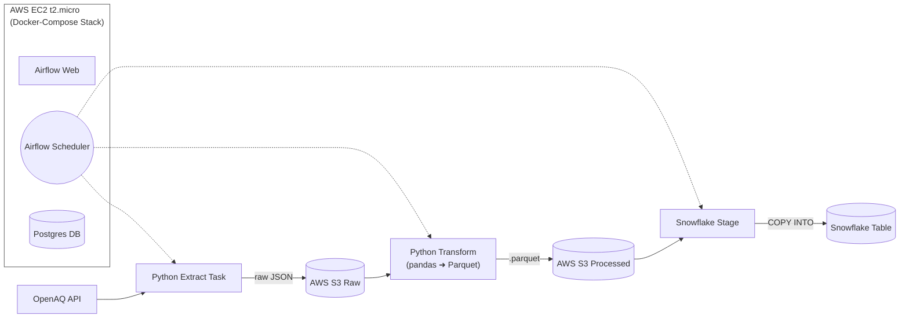

# Clean Air Pipeline

[](https://opensource.org/licenses/MIT)

An automated, containerized ETL pipeline that fetches air-quality data from OpenAQ daily, stores raw JSON in AWS S3, transforms it to Parquet with Python, and loads it into Snowflake as fact-dimensional data model. Orchestrated with Apache Airflow and deployable on AWS EC2 or any Docker-capable server. This pipeline helps researchers and data analysts to quickly obtain processed datasets from public sensors.

---

## Features

* **Extract:** Pulls PM₂.₅ measurements from OpenAQ for a configurable country.
* **Raw Storage:** Saves raw JSON using Hive-style partitioning (raw/YYYY/MM/) in local storage or AWS S3.
* **Transform:** Converts JSON → Parquet (pandas + PyArrow) into `processed/` (or S3/processed).
* **Load:** Loads Parquet into a pre-defined fact-dimensional model via Snowflake external stage & COPY INTO.
* **Orchestration:** Airflow DAG with retries, logging, and scheduling.
* **Container Deployment:** Docker Compose stack for Airflow, Postgres, ETL.
* **Auto-run:** 24/7 operation on AWS EC2 (t2.micro) or any VPS.

---

## Components & Architecture

This pipeline is designed to be modular. The core consists of Python scripts running in a Docker environment. The reference implementation shown here uses AWS S3 as a data lake and Snowflake as a data warehouse.

### Core Prerequisites (Minimal Setup)
* **Docker & Docker Compose:** To run the containerized application (Airflow, Python tasks).
* **Python 3.9+:** Used within the Docker containers.

### Prerequisites for the Reference Implementation (with Cloud)
* **AWS Account:** Required to store data persistently on **S3**. However, the scripts can be easily adapted to use local file storage instead.
* **Snowflake Account:** Serves as the target data warehouse. The `LOAD` logic is specific to Snowflake but can serve as a template for loading data into any other SQL database.



---

## Getting Started: Installation & Setup

This guide helps you to set up and run the entire reference implementation. The configuration is managed via a central `.env` file.

### 1. Environment Setup

First, clone the repository and set up the Python virtual environment.

```bash
git clone git@github.com:LeoGr777/clean-air-pipeline.git
cd clean-air-pipeline

# Create and activate virtual environment
python3 -m venv .venv
source .venv/bin/activate

# Ensure pip, the package manager, is up-to-date
pip install --upgrade pip

# Install the project dependencies from pyproject.toml
# -e installs it in "editable" mode
# [dev] installs the optional development dependencies
pip install -e ".[dev]"
```

> [!NOTE]
> The application will automatically create the necessary local directories like raw/ or processed/ on its first run. A manual mkdir is not required.

### 2. Central Configuration
API Key and identifiers are stored in an .env file. 

```
# .env file

# OpenAQ API Access
API_KEY=your-api-key

# AWS Configuration
AWS_S3_BUCKET=your-bucket-name
```
### 3. AWS Setup (S3 & IAM)
The pipeline requires 
- An S3 bucket for storage 
- IAM roles with required permissions for
  - EC2 to run the pipeline
  - Snowflake to read from S3
- Policies to realize permissions

**EC2 policy:**
```JSON
{
    "Version": "2012-10-17",
    "Statement": [
        {
            "Sid": "AllowBucketListing",
            "Effect": "Allow",
            "Action": "s3:ListBucket",
            "Resource": "arn:aws:s3:::<YOUR_BUCKET_NAME>"
        },
        {
            "Sid": "AllowObjectActions",
            "Effect": "Allow",
            "Action": [
                "s3:GetObject",
                "s3:PutObject",
                "s3:DeleteObject"
            ],
            "Resource": "arn:aws:s3:::<YOUR_BUCKET_NAME>/*"
        }
    ]
}
```
**Snowflake role policy:**
```JSON
{
    "Version": "2012-10-17",
    "Statement": [
        {
            "Effect": "Allow",
            "Action": [
                "s3:GetObject",
                "s3:GetObjectVersion"
            ],
            "Resource": "arn:aws:s3:::<YOUR_BUCKET_NAME>/*"
        },
        {
            "Effect": "Allow",
            "Action": [
                "s3:ListBucket"
            ],
            "Resource": "arn:aws:s3:::<YOUR_BUCKET_NAME>"
        }
    ]
}
```
**Snowflake role trust relationship trust policy:** (This step is to be done after creating all objects  within Snowflake which is explained in the following section)
```JSON
{
    "Version": "2012-10-17",
    "Statement": [
        {
            "Effect": "Allow",
            "Principal": {
                "AWS": "<THE_COPIED_STORAGE_AWS_IAM_USER_ARN>"
            },
            "Action": "sts:AssumeRole",
            "Condition": {
                "StringEquals": {
                    "sts:ExternalId": "<THE_COPIED_STORAGE_AWS_EXTERNAL_ID>"
                }
            }
        }
    ]
}
```

### 4. Snowflake Setup (via Script)
To avoid manual errors, all required Snowflake objects (Database, Schema, Tables, Stage, etc.) are created by a single script. This script also uses a STORAGE INTEGRATION, which is the secure, recommended way to connect Snowflake to S3 without storing AWS keys in Snowflake.

Fill in knowns: Open the setup script setup/snowflake_setup.sql and fill in your SNOWFLAKE_WAREHOUSE and SNOWFLAKE_DATABASE.

Execute the Script: Run the entire SQL script in your Snowflake worksheet. It will create everything needed.

Get Integration Details: After running the script, execute the following command in Snowflake to get the identifiers needed to link AWS and Snowflake:

DESC INTEGRATION s3_integration;

Update .env: Copy the STORAGE_AWS_IAM_USER_ARN and STORAGE_AWS_EXTERNAL_ID values from the command output into your .env file.

Update IAM: Grant the IAM User from Step 3 permissions to assume the role created by Snowflake (this step connects the two services).

### 5. Run the Pipeline (section under construction)
Once your .env file is complete, you can start the entire stack.

docker-compose up -d

This will start Apache Airflow. Open your browser to http://localhost:8080, enable the clean_air_pipeline DAG, and trigger a run.


#### Pipeline Steps

1. **extract\_openaq.py**

   ```bash
   python src/extract_openaq.py
   ```

   → saves JSON in `raw/YYYY/MM/`

2. **upload\_to\_s3**
   – add `boto3` function or Airflow task to upload raw files

3. **transform\_parquet.py**
   – `pandas.json_normalize` → `to_parquet(...)` → `processed/dt=YYYY-MM-DD/`

4. **Airflow DAG**
   – `dags/openaq_pipeline.py`, schedule `0 */3 * * *`

5. **Snowflake COPY**
   – Airflow PythonOperator or SnowflakeOperator runs:

   ```sql
   COPY INTO air_quality
   FROM @openaq_stage
   FILE_FORMAT=(TYPE=PARQUET);
   ```

---

## Project Structure (section under construction)

```
clean-air-pipeline/
├── .venv/                  
├── raw/                    # raw JSON files (or S3/raw)
├── processed/              # Parquet files (or S3/processed)
├── src/
|   ├── utils/
|   |   |── __init__.py
|   |   |── extract_openaq_utils.py
|   |   |── transform_utils.py
|   |── __init__.py
│   ├── extract_openaq_locations.py
│   ├── extract_openaq_parameters.py
│   ├── extract_openaq_sensors.py
│   ├── transform_dim_location.py
│   ├── transform_dim_parameter.py
│   ├── transform_dim_sensor.py
├── dags/
│   └── openaq_pipeline.py
├── tests/
├── docker-compose.yaml
├── Dockerfile              # ETL container
├── .env
├── .gitignore
├── pyproject.TOML
└── README.md
```

---

## Troubleshooting

* **Permission denied (publickey)** → missing SSH key on GitHub
* **AWS 403** → check S3 bucket policy
* **Airflow tasks failing** → inspect logs in Airflow UI
* **Parquet schema errors** → verify JSON structure with `jq`

---

## Contributing

1. Open an issue or feature request
2. Fork and create a feature branch
3. Submit a pull request with prefixes like `feat:` or `fix:`
4. Review & merge

---

## License

MIT © 2025 LeoGr777